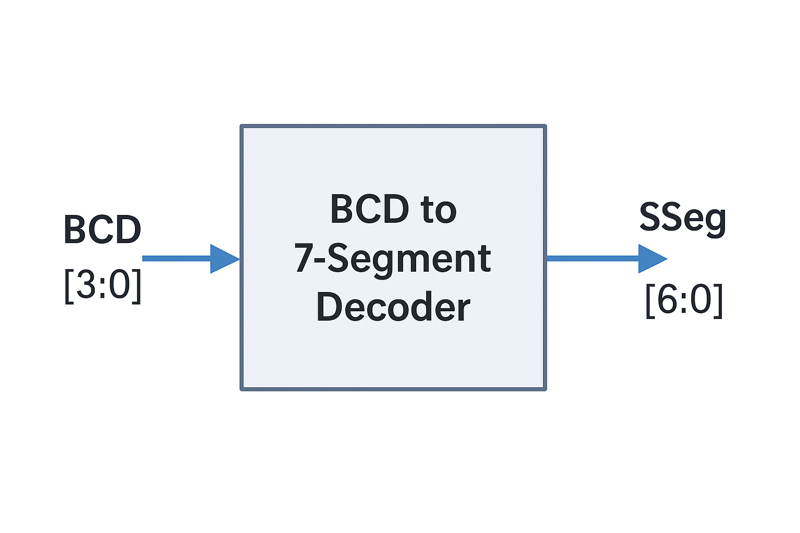
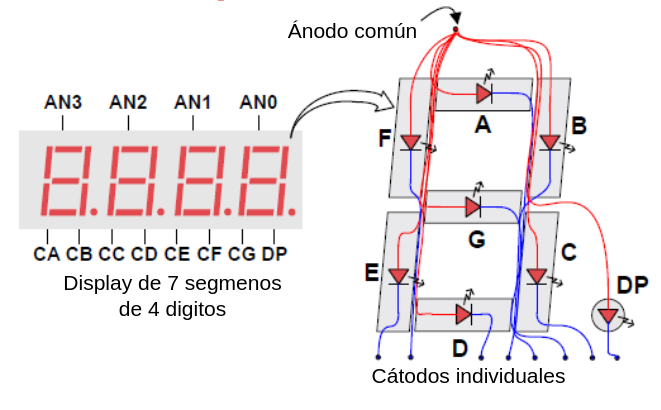
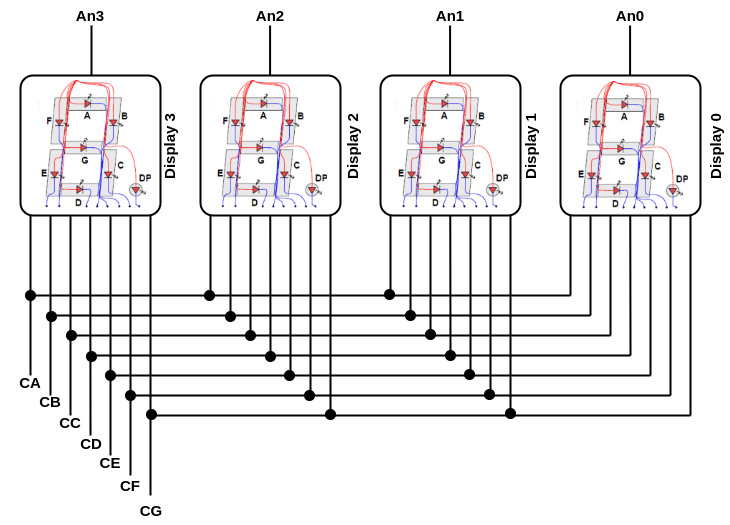
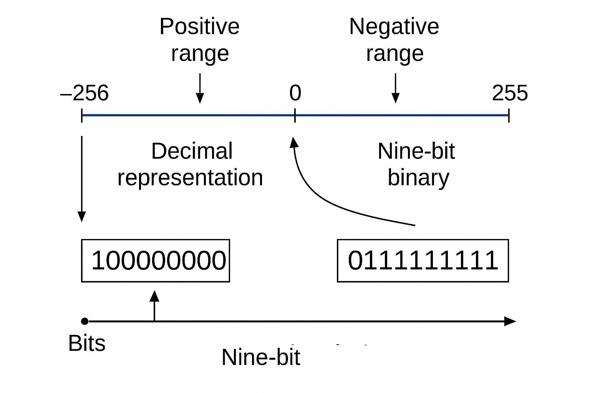
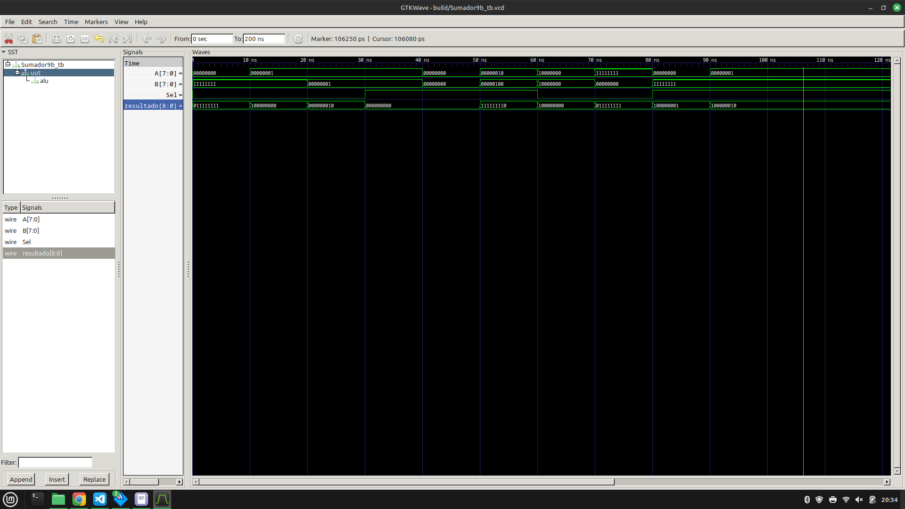
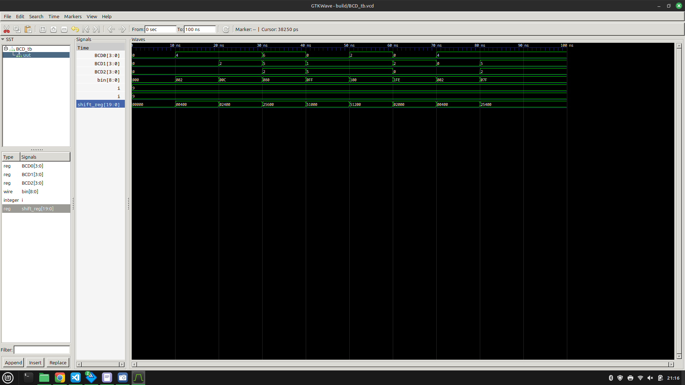
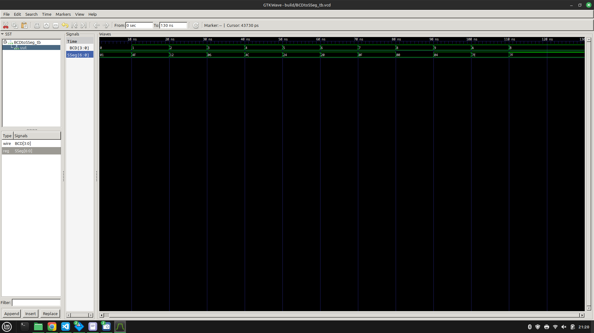
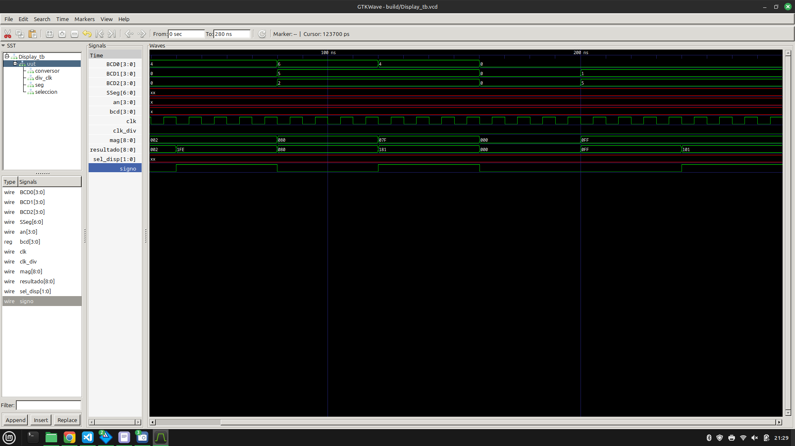
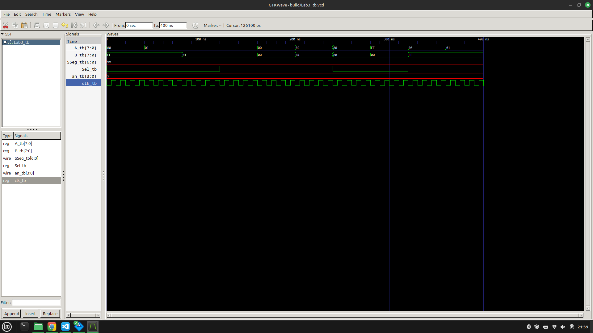

# Lab03: Decodificador BCD a 7segmentos

## Integrantes 
- [José Luis Pulido Fonseca](https://github.com/jpulidof)  
- [Nicolle Stefannie Ospina Pérez](https://github.com/stefannie4)
- [Ana María Orozco Reyes](https://github.com/anaor17)

## Informe

Indice:

1. [Diseño implementado](#1-diseño-implementado)
2. [Descripción](#2-descripción)
3. [Diagramas](#3-diagramas)
4. [Simulaciones](#4-simulaciones)
5. [Implementación](#5-implementación)
6. [Conclusiones](#conclusiones)

## 1. Diseño implementado

### Decodificador BCD a 7 segmentos

#### Descripción estructural

El sistema de visualización está compuesto principalmente por tres módulos:

- **BCD**: Convierte un número binario de 9 bits (rango de −255 a 510) en tres dígitos BCD de 4 bits cada uno (centenas, decenas y unidades). Esta conversión permite representar resultados mayores a 255 (como 510) y también números negativos en valor absoluto (como -127).

- **BCDtoSSeg**: Traduce un dígito BCD (de 0 a 15) a la codificación necesaria para activar los segmentos correspondientes de un display de 7 segmentos de ánodo común. Además de los dígitos del 0 al 9, el módulo decodifica:
  - 10: signo negativo ('−')
  - 11: blanco (sin segmento encendido)

- **Display**: Se encarga de controlar el proceso de multiplexación de los displays. Selecciona cuál dígito BCD se debe visualizar en cada instante (centenas, decenas, unidades o signo) y dirige esa señal al módulo `BCDtoSSeg`. Este módulo se actualiza cíclicamente usando un divisor de frecuencia y un contador de selección.

#### Descripción comportamental

- El módulo `BCD` utiliza el algoritmo conocido como **Double Dabble** (desplazamiento y suma de 3) para convertir un número binario en su equivalente BCD.

  - Se inicializa un registro de desplazamiento (`shift_reg`) de 21 bits.
  - Se cargan los 9 bits binarios (resultado de la operación A ± B) en las posiciones inferiores del registro.
  - Durante 9 ciclos:
    - Si las secciones que representan centenas, decenas o unidades son mayores o iguales a 5, se les suma 3.
    - Luego, se realiza un desplazamiento a la izquierda de todo el registro.
  - Finalmente, se extraen los valores:
    - `BCD0 = shift_reg[11:8]` (unidades)
    - `BCD1 = shift_reg[15:12]` (decenas)
    - `BCD2 = shift_reg[19:16]` (centenas)

- El módulo `BCDtoSSeg` contiene una estructura `case` que asigna el patrón de segmentos para cada valor BCD. El display es de tipo **ánodo común**, por lo que un bit en '0' activa el segmento correspondiente.

- El módulo `Display` administra la visualización dinámica usando multiplexación:
  - Controla qué display está activo en cada instante mediante el módulo `SelAn`, que utiliza un contador cíclico de 2 bits.
  - A cada ciclo de refresco, selecciona y muestra una de las cifras convertidas (centenas, decenas, unidades o el signo).

Este diseño permite mostrar correctamente valores entre -255 y 510, con signo cuando sea necesario, y sin pérdida de resolución, respetando el orden y el tiempo de persistencia visual requerido para que el ojo humano perciba la cifra completa.

## 2. Descripción

Este proyecto implementa un sistema completo en Verilog que permite realizar operaciones aritméticas (suma y resta) entre dos operandos de 8 bits (`A` y `B`), y visualizar el resultado en un conjunto de 4 displays de 7 segmentos con multiplexación. El sistema puede mostrar correctamente valores desde -255 hasta 510, respetando el signo y la magnitud.

Está compuesto por los siguientes módulos:

### Módulo `DivFrec` – Divisor de Frecuencia

#### Descripción estructural

Este módulo genera una señal de reloj más lenta (`clk_out`) a partir del reloj del sistema (`clk`). Utiliza un contador de N bits (por ejemplo, 20 bits) que se incrementa en cada flanco de subida del reloj de entrada.

El bit medio del contador (por ejemplo, `count[16]`) se utiliza como salida de reloj dividida, con una frecuencia `clk / 2^17`.

#### Descripción comportamental

- **Entrada**:
  - `clk`: Reloj del sistema.
- **Salida**:
  - `clk_out`: Señal de reloj dividida, ideal para controlar la multiplexación de displays sin parpadeo.

### Módulo `SelAn` – Selector de Ánodo

#### Descripción estructural

Este módulo activa secuencialmente uno de los cuatro displays de 7 segmentos conectados, mediante señales activas en bajo (`an[3:0]`). Utiliza un contador de 2 bits (`sel`) que rota entre 00, 01, 10 y 11, sincronizado con el reloj dividido del módulo `DivFrec`.

#### Descripción comportamental

- **Entrada**:
  - `clk`: Reloj lento proveniente de `DivFrec`.
- **Salidas**:
  - `sel`: Selección interna del dígito actual.
  - `an`: Señal que activa un solo display en cada instante.

El valor de `sel` se utiliza en otros módulos para decidir qué dígito se debe mostrar, manteniendo los tres restantes apagados en ese instante. Este procedimiento de escaneo rápido se percibe como visualización estable.

### Módulo `SelBCD` (usado en pruebas preliminares)

#### Descripción estructural

Este módulo fue utilizado en las primeras pruebas para seleccionar manualmente qué dígito BCD mostrar y en qué display mostrarlo. Utiliza interruptores DIP para definir:

- `DIP_BCD[3:0]`: Valor del dígito (0 a 15).
- `DIP_SEL[1:0]`: Display activo (0 a 3).

#### Descripción comportamental

- **Entradas**:
  - `DIP_BCD`: Dígito a mostrar (BCD o código especial).
  - `DIP_SEL`: Display activo.
- **Salidas**:
  - `SSeg`: Señal de control para los 7 segmentos.
  - `an`: Ánodo activo para el display seleccionado.

Internamente, el módulo instancia a `BCDtoSSeg` para la conversión del dígito, y decodifica `DIP_SEL` para activar el display correspondiente.

Este módulo fue útil para verificar la codificación BCD en los displays antes de integrar la lógica aritmética.

### Módulo `sumres8b` – Suma o Resta de 8 bits con selección

#### Descripción estructural

Este módulo permite realizar operaciones aritméticas básicas (suma y resta) entre dos operandos de 8 bits (`A` y `B`) según el valor de una señal de control `Sel`.

- Se calcula `B_xor_Sel = B ^ {8{Sel}}`.  
  - Si `Sel = 0` → `B_xor_Sel = B` (suma)
  - Si `Sel = 1` → `B_xor_Sel = ~B` (inicio de resta en complemento a dos)

- El carry-in (`Ci`) se iguala a `Sel`:
  - En suma (`Sel = 0`), `Ci = 0`
  - En resta (`Sel = 1`), `Ci = 1` → `A + (~B) + 1 = A - B`

- El resultado parcial se obtiene desde un sumador estructural (`sum8b`) y luego:
  - Si es una resta, se invierte la salida para aplicar el complemento a dos final.

Este diseño implementa correctamente la operación aritmética **A ± B** con complemento a dos.

#### Descripción comportamental

Según el valor de `Sel`, el módulo ejecuta:
- Una suma directa (`Sel = 0`)
- Una resta (`Sel = 1`), usando lógica de complemento a dos y ajuste final por inversión de bits.

### Módulo `Sumador9b` – Salida con signo

#### Descripción estructural

Este módulo encapsula `sumres8b` y genera un resultado de 9 bits con signo.

- El bit más significativo (`resultado[8]`) representa el signo:
  - `0`: positivo
  - `1`: negativo

- Los 8 bits restantes (`resultado[7:0]`) contienen el resultado de la operación.

Este resultado se pasa al módulo `Display`, el cual interpreta el bit de signo y convierte la magnitud a BCD para ser visualizada.

#### Descripción comportamental

- El módulo actúa como una interfaz entre la lógica aritmética y el sistema de visualización.
- Detecta el signo de la operación y lo incluye como parte del dato de salida para que pueda mostrarse como un carácter ‘-’ si es negativo.
- Soporta correctamente valores en el rango de -255 a 510, mostrando el resultado en displays de 7 segmentos.

## 3. Diagramas
### Decodificador BCD a 7 segmentos

El siguiente diagrama representa un módulo decodificador BCD a 7 segmentos, encargado de convertir un número en formato BCD (Binary Coded Decimal) en señales de control para encender los segmentos apropiados de un display de 7 segmentos de ánodo común.

#### Entradas

- `BCD[3:0]`: Señal de entrada de 4 bits que representa un número decimal del 0 al 9 (BCD válido). También se pueden interpretar ciertos valores adicionales para representar caracteres especiales como el signo negativo o espacios en blanco.

#### Salidas

- `SSeg[6:0]`: Señal de salida que controla los siete segmentos del display (a, b, c, d, e, f, g).
  - En displays de ánodo común, un `0` activa el segmento correspondiente.
  - Cada combinación de bits encenderá los segmentos necesarios para mostrar un dígito decimal específico.

#### Lógica interna

El decodificador implementa una lógica combinacional (generalmente con una instrucción `case`) que asigna a cada valor BCD el patrón correspondiente de segmentos.

Por ejemplo:
- `BCD = 0000` → `SSeg = 0000001` para mostrar "0"
- `BCD = 0001` → `SSeg = 1001111` para mostrar "1"
- ...
- `BCD = 1001` → `SSeg = 0000100` para mostrar "9"

También se pueden incluir valores especiales:
- `BCD = 1010` → representa el signo negativo ('-') → solo el segmento `g` encendido.
- `BCD = 1011` → todos los segmentos apagados → representa espacio en blanco.

#### Aplicación

Este módulo es utilizado dentro de un sistema más amplio que convierte resultados binarios a formato legible para el usuario. En particular, se usa junto con un módulo de conversión binario-a-BCD y un sistema de multiplexación de displays. Es fundamental en proyectos como relojes digitales, calculadoras, interfaces embebidas y sistemas de visualización numérica en FPGA.

 

### Visualización dinámica 4 displays de 7 segmentos

Los siguientes diagramas ilustran cómo se realiza la visualización dinámica en un sistema con 4 displays de 7 segmentos de tipo ánodo común.

#### Diagrama 1: Estructura interna del display de 7 segmentos

En este esquema se muestra cómo está construido internamente un display de 7 segmentos con punto decimal (DP) y cómo se conectan los ánodos y cátodos:

- Cada segmento (A–G y DP) está compuesto por un LED controlado individualmente.
- Todos los segmentos comparten un **ánodo común**, al cual se aplica un nivel lógico alto (3.3V).
- Los **cátodos son independientes**, y se activan colocando el bit correspondiente a nivel bajo (`0`).
- Para encender un segmento específico, se aplica `1` al ánodo común del dígito y `0` al cátodo del segmento deseado.

Este tipo de conexión permite controlar múltiples displays con un conjunto compartido de líneas de segmento y líneas de selección de display (ánodos).

 

#### Diagrama 2: Multiplexación de displays

El segundo diagrama representa la técnica de multiplexación utilizada para mostrar diferentes dígitos de manera secuencial pero rápida:

- Los cuatro displays (Display 0 a Display 3) comparten las líneas de segmento (`CA` a `CG`), que controlan los segmentos A–G.
- Cada display tiene su propia línea de **ánodo** (`An0` a `An3`) que actúa como señal de habilitación.
- En un instante dado, solo uno de los displays es activado mediante su línea de ánodo correspondiente.
- El sistema alterna rápidamente entre los displays, actualizando el valor de los segmentos para cada uno.
- Gracias a la persistencia visual del ojo humano, esta alternancia rápida se percibe como si todos los displays estuvieran encendidos al mismo tiempo.

Esta técnica permite reducir el número de pines requeridos para la conexión física, reutilizando las mismas líneas de segmento para múltiples dígitos.

 

### Representación decimal de números negativos

El siguiente diagrama ilustra cómo se representa un número negativo en un sistema de visualización decimal basado en displays de 7 segmentos.

#### Contexto

En sistemas digitales como los implementados en FPGA, los resultados de operaciones aritméticas se manejan internamente en **complemento a dos**. Sin embargo, esta representación binaria debe transformarse en una forma legible para el usuario: decimal con signo.

#### Conversión binario → decimal con signo

1. El módulo `sumres8b` realiza la suma o resta entre dos operandos de 8 bits. El resultado puede ser positivo o negativo, y se representa en 9 bits (bit de signo + 8 bits de magnitud).
2. El bit más significativo (`resultado[8]`) indica el **signo** del número:
   - `0`: el número es positivo.
   - `1`: el número es negativo (en complemento a dos).
3. Si el número es negativo:
   - Se convierte a valor absoluto aplicando el complemento a dos nuevamente.
   - Se pasa este valor absoluto al módulo de conversión binario a BCD (`BCD.v`).
4. Paralelamente, se activa la visualización del carácter **'-'** (guion medio) en el display más significativo para indicar el signo.

#### Visualización en displays de 7 segmentos

- El número se muestra en formato **decimal con signo**.
- Ejemplo:
  - Resultado interno: `1_10000001` → -127
  - Valor absoluto: `01111111` = 127
  - Visualización: `-127`
- El signo se ubica en el segundo dígito más significativo para dar claridad y evitar confusión con los ceros.

Este enfoque asegura una presentación clara, precisa y legible del resultado final, sin que el usuario deba interpretar representaciones binarias o formatos internos.

 

## 4. Simulaciones 
Se realizó un testbench para cada uno de los siguientes bloques: Sumador de 9 bits, BCD, BDCtoSSeg, Display y Lab3, el cual es el módulo principal. En las que involucraban algún tipo de clock, se realizó una simulación del mismo satisfactoria, explicada en los testbench del repositorio. Finalmente, los resultados fueron satisfactorios, por lo que se continuó en la siguiente fase de diseño, la implementación. 

 

 

 

 

 

## 5. Implementación

La implementación del sistema se realizó utilizando el entorno de desarrollo **Intel Quartus Prime**, orientado a dispositivos FPGA de la familia **Cyclone IV EP4CE6E22C8N**. Todo el diseño fue codificado en **Verilog HDL**, simulado, sintetizado y cargado físicamente sobre la FPGA de la tarjeta **A‑C4E6E10**.

### Arquitectura modular

El sistema fue implementado de forma completamente modular, permitiendo pruebas independientes de cada bloque funcional:

- La lógica aritmética (`sumres8b`, `Sumador9b`) se probó por separado mediante entradas fijas y switches físicos.
- El conversor `BCD` y el decodificador `BCDtoSSeg` fueron validados inicialmente con un módulo `SelBCD` que permite forzar dígitos específicos en los displays.
- La multiplexación de displays se controló usando los módulos `DivFrec` y `SelAn`, asegurando una visualización estable y sin parpadeos perceptibles.

### Errores y ajustes en hardware

Durante la implementación en la FPGA, se presentaron diversos desafíos que requirieron ajustes en el diseño:

- **Bits corridos en A y B**: Inicialmente, los valores ingresados por los switches no se alineaban correctamente con los bits del bus. Esto provocaba resultados incorrectos como omitir el bit menos significativo o duplicar el más significativo. El problema se no se puedo resolver.

- **Lógica negada en entradas**: Algunos switches estaban activos en bajo, por lo que fue necesario invertir señales a nivel de entrada o ajustar el comportamiento lógico para que se interpretaran correctamente como 1 cuando estaban "encendidos".

- **Orden de displays**: Los valores mostrados en los displays estaban desordenados (por ejemplo, se veía `3214` en lugar de `1234`). Esto se corrigió ajustando el orden en que se mapean los dígitos `BCD2`, `BCD1`, `BCD0` y el signo dentro del módulo `Display`.

Estos errores fueron útiles para comprender la importancia de la coherencia entre el diseño lógico y el hardware físico, así como la necesidad de validar visualmente las conexiones y el orden de los bits.

### Conversión binaria a decimal

Para convertir los resultados binarios a formato decimal legible, se optó por implementar el algoritmo **Double Dabble**, en lugar del método aritmético visto en clase. Las razones fueron:

- El método clásico (división/modulo) resultó ineficiente para FPGA, debido a su alto consumo de lógica combinacional y recursos.
- `Double Dabble` solo utiliza comparaciones y desplazamientos, lo cual lo hace altamente eficiente y escalable.
- El algoritmo genera los dígitos BCD de manera determinista, ideal para su integración con el decodificador de 7 segmentos.

### Resultado

Tras integrar y probar cada bloque funcional, el sistema completo fue validado con distintos casos de suma y resta, mostrando correctamente los resultados desde `-510` hasta `1020`, incluyendo el signo negativo y preservando el orden decimal correcto, pero teniendo en cuenta el error que no se pudo resolver.

## 6. Conclusiones

- El algoritmo **Double Dabble** demostró ser una excelente opción para implementar el convertidor binario a BCD en FPGA, gracias a su eficiencia al utilizar únicamente desplazamientos y comparaciones simples. Esto se tradujo en un menor consumo de recursos lógicos, lo cual es crucial en sistemas embebidos y diseños digitales limitados en área o potencia.

- A lo largo del desarrollo, se evidenció la importancia de alinear correctamente la lógica del diseño con las características físicas del hardware. Errores como el desalineamiento de bits, la lógica negada en switches, o el orden incorrecto de los displays fueron solucionados mediante ajustes estructurales y de asignación de pines, fortaleciendo el entendimiento entre el diseño lógico y su implementación real.

- El sistema final logró realizar operaciones de suma y resta entre números de 8 bits, mostrando correctamente resultados firmados desde -510 hasta 1020 en displays de 7 segmentos, teniendo en cuenta el error que no se pudo corregir, lo cual no afectó la lógica general. Se validó el correcto funcionamiento de la conversión, el control de signo, y la multiplexación visual, logrando una visualización estable y sin parpadeos.

- El diseño modular permitió probar y depurar cada componente de manera individual, facilitando la integración y el diagnóstico de errores. Esto refuerza la importancia del diseño jerárquico en proyectos de lógica digital.

- En conjunto, se obtuvo un sistema robusto, preciso, escalable y adaptable, con potencial para ser utilizado o extendido en el proyecto final o en aplicaciones similares que requieran procesamiento y visualización de datos numéricos en tiempo real desde hardware programable.

